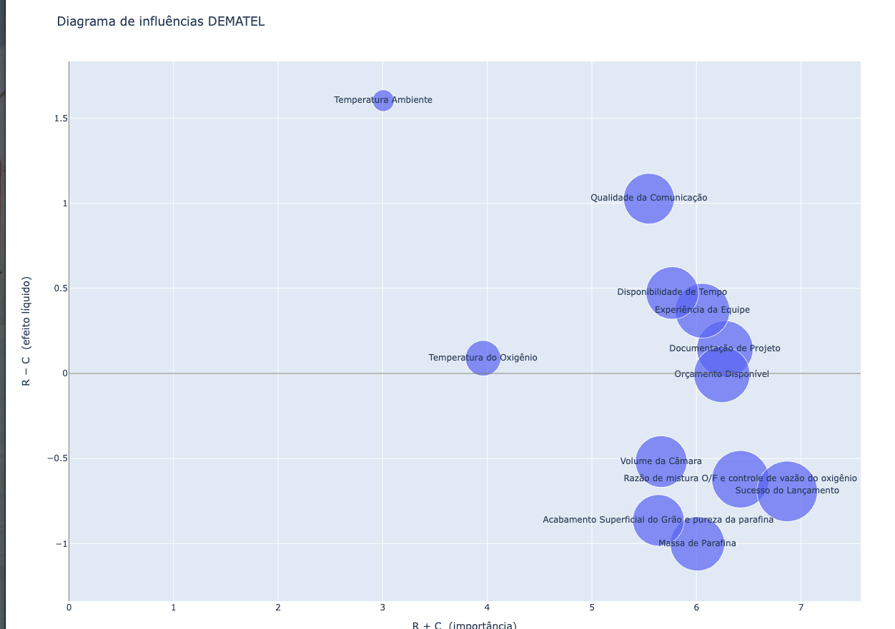
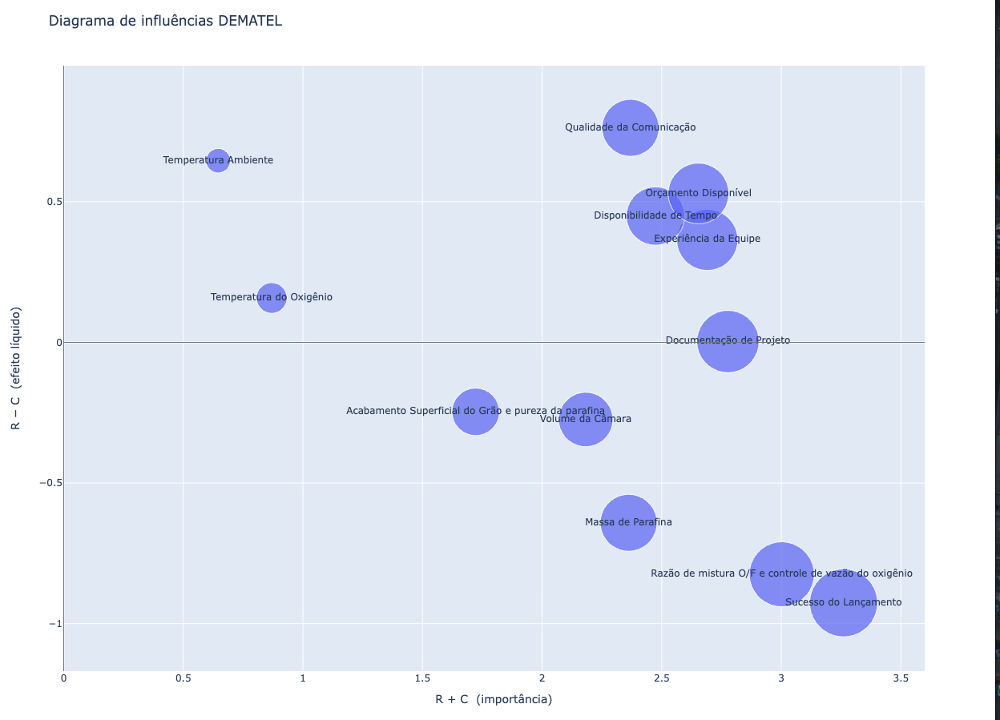

## 21 de set

### TESTE 1
    Eu alterei o prompt para incluir a descrição dos fatores, o que deveria melhorar a qualidade das respostas.
    Porém, a matriz gerada quase não teve zeros, o que é estranho. Talvez o modelo esteja "forçando" a dar uma nota alta para tudo.
    Uma sugestão é melhorar o prompt para enfatizar que muitos fatores não se influenciam diretamente.

    Exemplo:
    "[...] Considere que muitos fatores podem não ter influência direta, então sinta-se à vontade para responder 0 se achar que não há influência significativa."

    Matriz formada:
        Matriz formada: 
        [[0. 7. 8. 7. 7. 7. 7. 3. 7. 7. 2. 7.]
        [7. 0. 7. 7. 7. 7. 8. 3. 7. 7. 1. 8.]
        [8. 7. 0. 7. 7. 7. 7. 4. 7. 7. 2. 8.]
        [7. 7. 7. 0. 7. 6. 7. 3. 7. 7. 2. 7.]
        [7. 7. 6. 7. 0. 7. 7. 4. 7. 7. 0. 8.]
        [7. 4. 2. 3. 7. 0. 7. 3. 8. 6. 0. 8.]
        [7. 7. 3. 4. 6. 7. 0. 7. 7. 4. 2. 9.]
        [3. 3. 0. 3. 3. 3. 7. 0. 7. 6. 2. 7.]
        [4. 4. 2. 4. 6. 7. 7. 3. 0. 7. 2. 8.]
        [5. 4. 2. 4. 6. 4. 7. 3. 7. 0. 2. 7.]
        [3. 3. 3. 3. 3. 3. 7. 7. 6. 7. 0. 6.]
        [7. 7. 7. 7. 7. 7. 7. 3. 7. 7. 0. 0.]]

### Resultado
A alteração foi positiva. O LLM conseguiu captar melhor o que é um fator de causa e um fator de efeito, e a matriz resultante parece mais coerente e o gráfico do DEMATEL também.

    Matriz formada: 
        [[0. 6. 7. 4. 3. 6. 7. 2. 5. 3. 0. 7.]
        [7. 0. 7. 3. 3. 7. 7. 0. 7. 7. 0. 8.]
        [7. 7. 0. 6. 4. 6. 7. 3. 6. 4. 0. 7.]
        [7. 6. 7. 0. 4. 4. 6. 0. 5. 6. 0. 7.]
        [7. 5. 4. 6. 0. 7. 7. 3. 6. 7. 0. 7.]
        [3. 2. 0. 3. 5. 0. 7. 0. 7. 0. 0. 7.]
        [5. 4. 0. 3. 3. 6. 0. 3. 7. 0. 0. 9.]
        [0. 0. 0. 0. 0. 0. 7. 0. 3. 3. 0. 7.]
        [3. 2. 0. 2. 3. 3. 7. 0. 0. 3. 0. 8.]
        [2. 2. 0. 3. 3. 0. 6. 0. 3. 0. 0. 7.]
        [2. 2. 0. 2. 0. 0. 4. 3. 3. 4. 0. 5.]
        [6. 5. 3. 4. 7. 3. 7. 0. 3. 2. 0. 0.]]

Vou tentar agora colocar um fator que define quando um fator é causa ou efeito a partir da categoria do fator. Por exemplo, fatores qualitativos como temperatura ambiente e Orçamento disponível não podem ser consequências. Vou inicialmente tentar fazer isso a partir de uma alteração no prompt e, depois, forçar no código 0s na matriz.

### Teste 2
    Adicionei uma descrição de quem o agente deveria ser (um engenheiro aeroespacial) e também uma explicação do que seria um fator de causa e um fator de efeito, além de explicar que ele está respondendo um método DEMATEL.

    Adicionei um "viés" para que o modelo pensasse se um fator realmente pode ser alterado ou não (para dar nota 0 em casos em que o fator é apenas causa). 

    Rodei duas vezes com a mesma configuração (modelo gpt-4o) e obtive resultados muito semelhantes, demonstrando estabilidade no modelo.

    Algumas coisas começaram a aparecer: 
        - Por exemplo, o "volume da câmara" comecou a aparecer no ponto médio entre R-C e R+C, o que está em linha com o resultado do formulário. 
        - Mas a temperatura do oxigênio ainda é tida como um efeito Causa, enquanto os experts julgaram como um efeito consequência. Talvez valha revisitar isso entre experts
            Nesse cenário, eu levantaria a hipótese de que o formulário, por ser excessivamente grande, pode ter causado fatiga mental no julgamento. Outra hipótese não testada é a de embaralhar as perguntas ou perguntar duas vezes, para garantir consistência.

### Teste 3